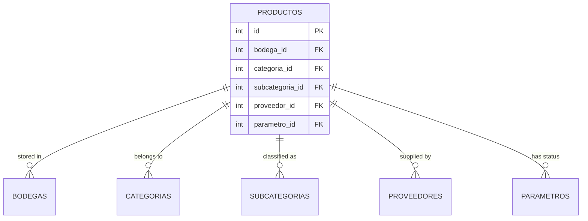

## Overview

The product management system serves as the core of Pro Stock Tool's inventory tracking capabilities. While the source code doesn't include a dedicated `productos.js` controller, the database schema and related modules reveal a comprehensive product tracking system integrated with warehouses, categories, suppliers, and status parameters.

## Key Features

- Centralized product database
- Integration with warehouses (bodegas)
- Category and subcategory classification
- Supplier association
- Status parameter tracking
- Product count tracking across all modules
- Foreign key relationships for data integrity

## Data Structure

Based on the integration points in the source code, products have the following relationships:

### Product Fields

| Field | Type | Description | Reference |
|-------|------|-------------|----------|
| `id` | Integer | Unique product identifier | Auto-generated |
| `bodega_id` | Integer | Warehouse location | FK to bodegas table |
| `categoria_id` | Integer | Product category | FK to categorias table |
| `subcategoria_id` | Integer | Product subcategory | FK to subcategorias table |
| `proveedor_id` | Integer | Supplier reference | FK to proveedores table |
| `parametro_id` | Integer | Product status | FK to parametros table |

<Note>
  The products table uses flexible foreign key naming. The system checks for multiple column name variants: `categoria_id`, `id_categoria`, `categoria`, or `categoriaId`.
</Note>

## Integration Points

Products are integrated throughout the system:

### Warehouse Integration

**Source Reference:** `bodega.php:236-249`

Before deleting a warehouse, the system checks:

```php
$productCheckSql = "SELECT COUNT(*) as count FROM productos WHERE bodega_id = $id";
$productResult = $conn->query($productCheckSql);

if ($productCount > 0) {
    echo json_encode([
        'success' => false,
        'error' => 'No se puede eliminar. Tiene ' . $productCount . ' producto(s) asociado(s)'
    ]);
}
```

This prevents orphaned products by blocking warehouse deletion when products are assigned.

### Category Integration

**Source Reference:** `categorias.php:256-289`

The category system uses dynamic FK detection:

```php
$candidateCols = ["categoria_id", "id_categoria", "categoria", "categoriaId"];

// Checks for column existence
foreach ($candidateCols as $cand) {
    $colSql = "SELECT 1 FROM INFORMATION_SCHEMA.COLUMNS 
               WHERE TABLE_NAME='productos' AND COLUMN_NAME='$cand'";
    // Uses first match
}
```

This intelligent detection supports different naming conventions and prevents deletion of categories with associated products.

### Supplier Integration

**Source Reference:** `proveedores.php:20`

Suppliers track product counts:

```php
SELECT pr.id, pr.nombre, ... 0 AS productos_count
FROM proveedores pr
```

While the count is currently hardcoded to 0, the schema supports future implementation of actual product counting per supplier.

**UI Display:** `proveedores.js:153`

```javascript
<div class="card-footer">${p.productos_count ?? 0} Productos</div>
```

### Status Parameter Integration

**Source Reference:** `parametros.php:16-27`

Parameters track which products use each status:

```php
SELECT par.id, par.codigo, par.nombre, par.color,
       COUNT(prod.id) AS productos_count
FROM parametros par
LEFT JOIN productos prod ON prod.parametro_id = par.id
GROUP BY par.id
```

This provides real-time product counts per status parameter.

**Deletion Protection:** `parametros.php:98-101`

```php
$cnt = $conn->query("SELECT COUNT(*) AS c FROM productos WHERE parametro_id=$id");
if ($cnt > 0) {
    echo json_encode(['error'=>'No se puede eliminar: tiene productos asociados']);
}
```

## Expected Product Workflows

While the dedicated product controller isn't in the provided source, we can infer the workflows from the system architecture:

### Creating a Product

<Steps>
  <Step title="Access product creation">
    Navigate to the product management section and click the create button.
  </Step>
  
  <Step title="Select warehouse">
    Choose the warehouse (bodega) where the product will be stored.
  </Step>
  
  <Step title="Choose category">
    Select the main category and optional subcategory for classification.
  </Step>
  
  <Step title="Assign supplier">
    Link the product to a supplier (proveedor) for tracking.
  </Step>
  
  <Step title="Set status">
    Choose a status parameter (e.g., ACTIVO, INACTIVO) from the available options.
  </Step>
  
  <Step title="Enter product details">
    Fill in additional product information like name, SKU, price, quantity, etc.
  </Step>
  
  <Step title="Save product">
    Submit the form to create the product with all associations.
  </Step>
</Steps>

### Updating Product Location

<Info>
  Products can be moved between warehouses by updating the `bodega_id` field. This enables inventory transfers and location tracking.
</Info>

### Deleting Products

Products should be deletable without constraints from other tables, as all foreign keys point FROM products TO other entities (not vice versa).

## Product Counts and Statistics

The system tracks product counts across multiple dimensions:

### By Warehouse

```javascript
// From bodega.js - currently shows 0, but schema supports actual counts
// Implementation would query: SELECT COUNT(*) FROM productos WHERE bodega_id = ?
```

### By Category

```javascript
// From categorias.js:162 - displays count on category cards
<span class="product-count">0 productos</span>
```

### By Supplier

```javascript
// From proveedores.js:153
<div class="card-footer">${p.productos_count ?? 0} Productos</div>
```

### By Status Parameter

```javascript
// From parametros.js:132 - actual database count
<td>${p.productos_count ?? 0}</td>
```

<Note>
  Only the parameters module currently implements live product counting via SQL JOIN. Other modules have the UI prepared but show static counts.
</Note>

## Database Schema Relationships



## Validation and Constraints

Based on the related modules, products enforce:

<AccordionGroup>
  <Accordion title="Referential Integrity">
    - **Warehouse**: Must reference valid `bodegas.id`
    - **Category**: Must reference valid `categorias.id`
    - **Supplier**: Must reference valid `proveedores.id`
    - **Status**: Must reference valid `parametros.id`
    - **Protection**: Parent records cannot be deleted while products exist
  </Accordion>
  
  <Accordion title="Orphan Prevention">
    The system prevents orphaned products by:
    - Blocking warehouse deletion if products exist
    - Blocking category deletion if products exist
    - Blocking parameter deletion if products exist
    - Showing exact count of blocking products in error messages
  </Accordion>
  
  <Accordion title="Flexible Schema">
    - **Column Detection**: Supports multiple FK naming conventions
    - **Null Handling**: Some fields may be optional (implementation-dependent)
    - **Table Existence**: Checks if productos table exists before validation
  </Accordion>
</AccordionGroup>

## API Patterns

Based on the consistent patterns across all modules, the products API likely follows:

```text
GET    /database/productos.php      # List all products with JOINs
POST   /database/productos.php      # Create new product
PUT    /database/productos.php      # Update product
DELETE /database/productos.php      # Delete product
```

### Expected GET Response

```json
{
  "success": true,
  "data": [
    {
      "id": 1,
      "nombre": "Product Name",
      "bodega_id": 2,
      "bodega_nombre": "Main Warehouse",
      "categoria_id": 5,
      "categoria_nombre": "Electronics",
      "categoria_color": "#2e6df6",
      "proveedor_id": 3,
      "proveedor_nombre": "Tech Supplies Inc",
      "parametro_id": 1,
      "parametro_nombre": "ACTIVO",
      "parametro_color": "#10B981"
    }
  ]
}
```

### Expected CREATE Request

```javascript
const response = await fetch('database/productos.php', {
  method: 'POST',
  headers: { 'Content-Type': 'application/json' },
  body: JSON.stringify({
    nombre: 'New Product',
    bodega_id: 2,
    categoria_id: 5,
    subcategoria_id: 12,
    proveedor_id: 3,
    parametro_id: 1,
    // Additional fields like SKU, price, quantity, etc.
  })
});
```

## UI Components

Based on the consistent UI patterns across modules, products likely use:

### Product Cards or Table Rows

Showing:
- Product name and SKU
- Warehouse badge with color
- Category badge with color
- Supplier name
- Status badge with parameter color
- Stock quantity
- Edit and delete actions

### Filtering and Search

```javascript
// Expected pattern from other modules
const buscarProducto = document.getElementById('buscarProducto');
buscarProducto.addEventListener('input', filtrarProductos);

function filtrarProductos() {
  const q = buscarProducto.value.toLowerCase().trim();
  const filtered = productos.filter(p =>
    p.nombre.toLowerCase().includes(q) ||
    p.sku.toLowerCase().includes(q) ||
    p.categoria_nombre.toLowerCase().includes(q)
  );
  renderProductos(filtered);
}
```

### Status Badges

Using parameter colors for visual status indication:

```javascript
<span class="badge-status" 
      style="background:${p.parametro_color}; color:#fff">
  ${p.parametro_nombre}
</span>
```

## Best Practices

<CardGroup cols={2}>
  <Card title="Complete Classification" icon="tags">
    Always assign warehouse, category, and status to products for proper organization
  </Card>
  
  <Card title="Supplier Tracking" icon="truck">
    Link products to suppliers for better procurement and vendor management
  </Card>
  
  <Card title="Status Updates" icon="rotate">
    Use status parameters to track product lifecycle (active, discontinued, etc.)
  </Card>
  
  <Card title="Warehouse Transfers" icon="arrows-turn-right">
    Update bodega_id when moving products between locations
  </Card>
  
  <Card title="Category Hierarchy" icon="sitemap">
    Utilize both category and subcategory for granular classification
  </Card>
  
  <Card title="Data Integrity" icon="shield-check">
    Ensure all foreign keys reference existing records before saving
  </Card>
</CardGroup>

## Technical Notes

### Foreign Key Detection

**Source:** `categorias.php:264-273`

The system uses intelligent FK detection:

```php
$candidateCols = ["categoria_id", "id_categoria", "categoria", "categoriaId"];
$categoryColumn = null;

foreach ($candidateCols as $cand) {
    $colSql = "SELECT 1 FROM INFORMATION_SCHEMA.COLUMNS 
               WHERE TABLE_SCHEMA='$dbName' 
               AND TABLE_NAME='productos' 
               AND COLUMN_NAME='$cand' 
               LIMIT 1";
    $colRes = $conn->query($colSql);
    if ($colRes && $colRes->num_rows > 0) {
        $categoryColumn = $cand;
        break;
    }
}
```

This allows the database to use different naming conventions while maintaining compatibility.

### Count Aggregation

**Source:** `parametros.php:18-22`

Example of proper product counting:

```php
SELECT par.id, par.nombre, par.color,
       COUNT(prod.id) AS productos_count
FROM parametros par
LEFT JOIN productos prod ON prod.parametro_id = par.id
GROUP BY par.id, par.nombre, par.color
```

This pattern should be applied to warehouses, categories, and suppliers for accurate product counts.

### Cache Busting

All modules use timestamp-based cache busting:

```javascript
const url = `${API_URL}?_=${Date.now()}`;
fetch(url, { cache: 'no-store' });
```

This ensures fresh product data on every request.

## Common Error Messages

| Error Message | Cause | Solution |
|---------------|-------|----------|
| "Bodega no encontrada" | Invalid warehouse ID | Select a valid warehouse |
| "Categoría no encontrada" | Invalid category ID | Select an existing category |
| "Proveedor no encontrado" | Invalid supplier ID | Choose a valid supplier |
| "Parámetro no encontrado" | Invalid status ID | Select an active parameter |
| "No se puede eliminar bodega: tiene productos" | Deleting warehouse with products | Reassign products first |
| "No se puede eliminar categoría: tiene productos" | Deleting category with products | Recategorize products first |
| "No se puede eliminar parámetro: tiene productos" | Deleting status with products | Update product statuses first |
