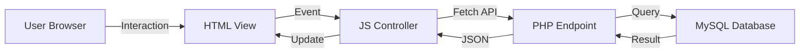

## Overview

Pro Stock Tool follows a classic three-tier architecture pattern separating frontend presentation, business logic, and data access layers. The project is organized into distinct directories, each serving a specific purpose in the application.

## Root Directory Structure

<CodeGroup>
```bash Project Tree
Pro-Stock-Tool/
├── controllers/       # JavaScript frontend controllers
├── database/          # PHP backend API endpoints
├── view/              # HTML page templates
├── styles/            # CSS stylesheets
├── img/               # Image assets
├── login.html         # Login page
└── Inicio-Sesion.html # Alternative login page
```
</CodeGroup>

## Directory Details

<AccordionGroup>
  <Accordion title="controllers/ - Frontend Logic" icon="js">
    Contains JavaScript files that handle client-side interactions and API communication.

    **Key Files:**
    - `bodega.js` - Warehouse management controller
    - `categorias.js` - Category/subcategory management
    - `proveedores.js` - Supplier management
    - `parametros.js` - System parameters configuration
    - `header-footer.js` - Shared navigation and layout
    - `registro.js` - User registration logic

    **Responsibilities:**
    - DOM manipulation and event handling
    - API requests using Fetch API
    - Client-side validation
    - UI state management
    - Modal and form interactions
  </Accordion>

  <Accordion title="database/ - Backend API" icon="database">
    PHP endpoints that handle HTTP methods (GET, POST, PUT, DELETE) and database operations.

    **Key Files:**
    - `conexion.php` - Database connection configuration
    - `bodega.php` - Warehouse CRUD operations
    - `categorias.php` - Category CRUD operations
    - `subcategorias.php` - Subcategory CRUD operations
    - `proveedores.php` - Supplier CRUD operations
    - `parametros.php` - System parameters CRUD
    - `registro.php` - User registration endpoint

    **Responsibilities:**
    - RESTful API endpoints
    - Database queries and transactions
    - Input validation and sanitization
    - JSON response formatting
    - CORS header management
  </Accordion>

  <Accordion title="view/ - HTML Pages" icon="browser">
    HTML templates for different sections of the application.

    **Key Files:**
    - `index.html` - Dashboard/home page
    - `bodega.html` - Warehouse management interface
    - `categoria.html` - Category management interface
    - `proveedores.html` - Supplier management interface
    - `parametros.html` - System parameters interface

    **Structure:**
    - Each page includes its corresponding CSS and JS files
    - Uses `header-footer.js` for consistent navigation
    - Follows semantic HTML5 structure
  </Accordion>

  <Accordion title="styles/ - CSS Stylesheets" icon="paintbrush">
    CSS files providing styling for each module.

    **Key Files:**
    - `header-footer.css` - Navigation and layout styles
    - `bodega.css` - Warehouse page styles
    - `categorias.css` - Category page styles
    - `proveedores.css` - Supplier page styles
    - `parametros.css` - Parameters page styles
    - `Style-Registro.css` - Registration form styles
    - `StyleInicio.css` - Login page styles

    **Styling Approach:**
    - Component-based CSS organization
    - Consistent color scheme (primary: `#2e6df6`, `#4a90e2`)
    - Responsive design patterns
    - Modal and card-based layouts
  </Accordion>

  <Accordion title="img/ - Image Assets" icon="image">
    Static images including logos, icons, and graphics.

    **Contents:**
    - `Pro-Stock-Sinfondo.png` - Main logo (transparent background)
    - Product images
    - UI icons and graphics
  </Accordion>
</AccordionGroup>

## Architecture Pattern

<Note>
Pro Stock Tool implements a **Model-View-Controller (MVC)** pattern:
- **Model**: PHP endpoints in `database/` handle data operations
- **View**: HTML templates in `view/` and root directory
- **Controller**: JavaScript files in `controllers/` manage user interactions
</Note>

### Request Flow



## Module Organization

Each major feature follows a consistent file naming convention:

<CardGroup cols={3}>
  <Card title="Frontend" icon="browser">
    `view/{module}.html`
  </Card>
  <Card title="Controller" icon="code">
    `controllers/{module}.js`
  </Card>
  <Card title="Backend" icon="server">
    `database/{module}.php`
  </Card>
  <Card title="Styles" icon="palette">
    `styles/{module}.css`
  </Card>
</CardGroup>

**Example - Warehouse Module:**
- `view/bodega.html` - User interface
- `controllers/bodega.js` - Client logic
- `database/bodega.php` - API endpoint
- `styles/bodega.css` - Styling

## Database Connection

The `database/conexion.php` file serves as the central database configuration:

```php database/conexion.php
<?php
$host = "localhost";
$user = "root";
$pass = "";
$db = "prostocktool";

$conn = new mysqli($host, $user, $pass, $db);
if ($conn->connect_errno) {
    http_response_code(500);
    echo json_encode(["error" => "Error de conexión a la base de datos"]);
    exit;
}
?>
```

<Tip>
All PHP endpoints include `conexion.php` using `require 'conexion.php';` to establish database connectivity.
</Tip>

## Path Resolution

The project uses relative paths based on file location:

<CodeGroup>
```html Pages in view/ directory
<link rel="stylesheet" href="../styles/header-footer.css">
<script src="../controllers/header-footer.js"></script>
```

```html Pages in root directory
<link rel="stylesheet" href="styles/Style-Registro.css">
<script src="controllers/registro.js"></script>
```

```javascript API URLs in controllers
const API_URL = 'http://localhost/Pro-Stock-Tool/database/bodega.php';
```
</CodeGroup>

## Best Practices

<CardGroup cols={2}>
  <Card title="Separation of Concerns" icon="layer-group">
    Keep HTML, CSS, and JavaScript in separate files for maintainability
  </Card>
  <Card title="Consistent Naming" icon="tag">
    Use matching file names across layers (e.g., `bodega.html`, `bodega.js`, `bodega.php`)
  </Card>
  <Card title="Modular Design" icon="cubes">
    Each module is self-contained with its own view, controller, and endpoint
  </Card>
  <Card title="Shared Components" icon="share-nodes">
    Common functionality like `header-footer.js` is reused across pages
  </Card>
</CardGroup>

## Next Steps

<CardGroup cols={2}>
  <Card title="Coding Standards" icon="code" href="/guides/coding-standards">
    Learn about code conventions and patterns
  </Card>
  <Card title="Troubleshooting" icon="wrench" href="/guides/troubleshooting">
    Common issues and solutions
  </Card>
</CardGroup>