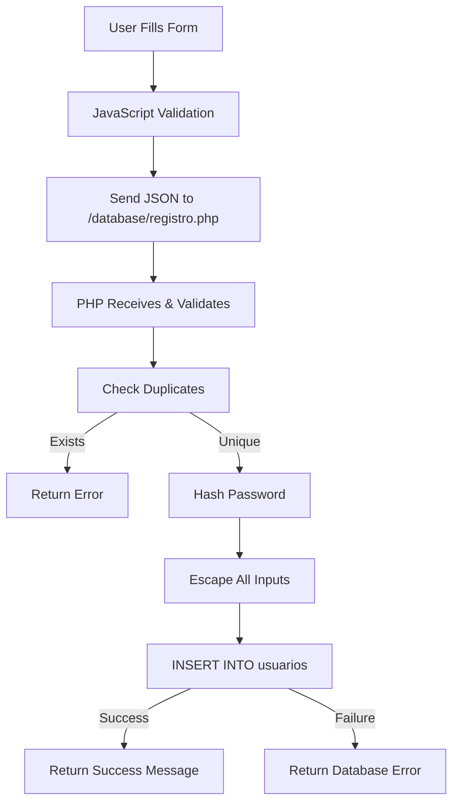
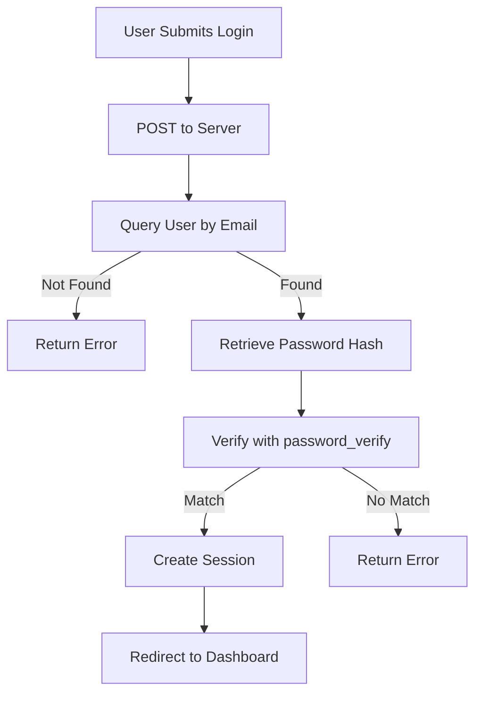

## Overview

User accounts in Pro Stock Tool are stored in the `usuarios` table within the `prostocktool` MySQL database. Each account contains essential user information and authentication credentials.

## Database Configuration

The system connects to the database using the following configuration (`conexion.php:3-8`):

```php
$host = "localhost";
$user = "root";
$pass = "";
$db = "prostocktool";

$conn = new mysqli($host, $user, $pass, $db);
```

<Note>
  The database connection includes automatic error handling that returns HTTP 500 status codes on connection failures.
</Note>

## User Table Structure

Based on the registration implementation, the `usuarios` table contains the following fields:

### Schema

| Column | Data Type | Constraints | Description |
|--------|-----------|-------------|-------------|
| `id` | INT | PRIMARY KEY, AUTO_INCREMENT | Unique user identifier |
| `email` | VARCHAR | UNIQUE, NOT NULL | User's email address |
| `nombre` | VARCHAR(100) | NOT NULL | User's full name |
| `identidad` | VARCHAR(20) | UNIQUE, NOT NULL | Government-issued ID number |
| `password` | VARCHAR(255) | NOT NULL | BCrypt hashed password |
| `creado_en` | TIMESTAMP | DEFAULT NOW() | Account creation timestamp |

### Field Details

#### Email

- **Purpose**: Primary identifier for user login
- **Validation**: Must pass email format validation
- **Uniqueness**: Each email can only be registered once
- **Example**: `user@example.com`

```php
if (!filter_var($email, FILTER_VALIDATE_EMAIL)) {
  echo json_encode(['success'=>false,'error'=>'Email inválido']);
}
```

#### Nombre (Name)

- **Purpose**: User's full name for identification
- **Length**: 2-100 characters
- **Validation**: Must contain at least 2 characters
- **Example**: `Juan David Pérez`

```php
if (strlen($nombre) < 2 || strlen($nombre) > 100) {
  echo json_encode(['success'=>false,'error'=>'Nombre inválido']);
}
```

#### Identidad (ID Number)

- **Purpose**: Government-issued identification number
- **Format**: Numeric only, 6-20 digits
- **Uniqueness**: Each ID can only be registered once
- **Example**: `1067623487`

```php
if (!preg_match('/^[0-9]{6,20}$/', $identidad)) {
  echo json_encode(['success'=>false,'error'=>'Identidad inválida']);
}
```

<Warning>
  Both email and ID number must be unique. The system prevents duplicate registrations by querying existing records before insertion.
</Warning>

#### Password

- **Storage**: BCrypt hashed (never plain text)
- **Minimum Length**: 6 characters (enforced at registration)
- **Algorithm**: `PASSWORD_BCRYPT`
- **Salt**: Automatically generated by PHP's `password_hash()`

```php
$hash = password_hash($contrasena, PASSWORD_BCRYPT);
$hashEsc = $conn->real_escape_string($hash);
```

<Note>
  BCrypt automatically handles salt generation and produces hashes approximately 60 characters long.
</Note>

#### Creado_en (Created At)

- **Purpose**: Timestamp of account creation
- **Type**: MySQL TIMESTAMP
- **Value**: Auto-populated using `NOW()` function
- **Format**: YYYY-MM-DD HH:MM:SS

## Account Creation Process

When a new user registers, the following SQL query is executed (`registro.php:51-52`):

```php
$sql = "INSERT INTO usuarios (email, nombre, identidad, password, creado_en) 
        VALUES ('$emailEsc', '$nombreEsc', '$identidadEsc', '$hashEsc', NOW())";

if ($conn->query($sql)) {
  echo json_encode(['success'=>true,'message'=>'Registro exitoso']);
} else {
  echo json_encode(['success'=>false,'error'=>'Error al registrar: ' . $conn->error]);
}
```

### Data Sanitization

All user inputs are sanitized before database insertion to prevent SQL injection:

```php
$emailEsc = $conn->real_escape_string($email);
$nombreEsc = $conn->real_escape_string($nombre);
$identidadEsc = $conn->real_escape_string($identidad);
$hashEsc = $conn->real_escape_string($hash);
```

## Duplicate Prevention

Before creating a new account, the system checks for existing records (`registro.php:42-45`):

```php
$check = $conn->query(
  "SELECT id FROM usuarios 
   WHERE email = '$emailEsc' OR identidad = '$identidadEsc' 
   LIMIT 1"
);

if ($check && $check->num_rows > 0) {
  echo json_encode([
    'success'=>false,
    'error'=>'Email o Identidad ya registrados'
  ]);
  exit;
}
```

<Steps>
  <Step title="Query existing records">
    Search for matching email or ID number in the usuarios table.
  </Step>
  
  <Step title="Check results">
    If any records are found, prevent account creation.
  </Step>
  
  <Step title="Return error">
    Inform user that credentials are already in use.
  </Step>
</Steps>

## User Authentication Flow

### Login Credentials

Users authenticate using:

1. **Email address** - Entered in the email field
2. **Password** - Verified against BCrypt hash

From the login form (`Inicio-Sesion.html:47-50`):

```html
<label for="email">Email</label>
<input type="email" placeholder="example@gmail.com" 
       name="email" required id="email">

<label for="contraseña">Contraseña</label>
<input type="password" name="Contraseña" required 
       id="Contraseña" placeholder="*****************">
```

### Password Verification

While the login controller isn't in the provided source, password verification typically uses:

```php
// Retrieve stored hash from database
$stored_hash = $row['password'];

// Verify submitted password against hash
if (password_verify($submitted_password, $stored_hash)) {
  // Password correct - create session
} else {
  // Password incorrect - deny access
}
```

<Note>
  PHP's `password_verify()` function is the complement to `password_hash()` and properly handles BCrypt comparison.
</Note>

## Security Considerations

### Password Security

<CardGroup cols={2}>
  <Card title="BCrypt Hashing" icon="lock">
    Industry-standard algorithm designed to be computationally expensive for brute-force attacks.
  </Card>
  
  <Card title="Automatic Salting" icon="shuffle">
    Each password hash includes a unique salt, preventing rainbow table attacks.
  </Card>
  
  <Card title="No Plain Text" icon="eye-slash">
    Passwords are never stored in readable format, only as irreversible hashes.
  </Card>
  
  <Card title="Minimum Length" icon="ruler">
    6-character minimum enforced on both client and server sides.
  </Card>
</CardGroup>

### Data Protection

<Tabs>
  <Tab title="Input Sanitization">
    All user inputs are escaped using `real_escape_string()` before database queries:
    
    ```php
    $emailEsc = $conn->real_escape_string($email);
    $nombreEsc = $conn->real_escape_string($nombre);
    $identidadEsc = $conn->real_escape_string($identidad);
    ```
  </Tab>
  
  <Tab title="SQL Injection Prevention">
    Proper escaping prevents malicious SQL code injection:
    
    - User input: `admin@test.com' OR '1'='1`
    - After escaping: `admin@test.com\' OR \'1\'=\'1`
    - Treated as literal string, not executable code
  </Tab>
  
  <Tab title="Connection Error Handling">
    Database connection failures are caught and return appropriate errors:
    
    ```php
    if ($conn->connect_errno) {
        http_response_code(500);
        echo json_encode(["error" => "Error de conexión a la base de datos"]);
        exit;
    }
    ```
  </Tab>
</Tabs>

## Account Data Flow

### Registration Flow



### Authentication Flow



## API Endpoints

### Registration Endpoint

**URL**: `/database/registro.php`  
**Method**: POST  
**Content-Type**: application/json

**Request Body**:
```json
{
  "email": "user@example.com",
  "nombre": "Juan David",
  "identidad": "1067623487",
  "contrasena": "mypassword123"
}
```

**Success Response**:
```json
{
  "success": true,
  "message": "Registro exitoso"
}
```

**Error Response**:
```json
{
  "success": false,
  "error": "Email o Identidad ya registrados"
}
```

### CORS Headers

The registration endpoint includes CORS headers for cross-origin requests (`registro.php:2-5`):

```php
header('Content-Type: application/json; charset=utf-8');
header('Access-Control-Allow-Origin: *');
header('Access-Control-Allow-Methods: POST, OPTIONS');
header('Access-Control-Allow-Headers: Content-Type');
```

<Warning>
  In production, replace `Access-Control-Allow-Origin: *` with specific trusted domains for better security.
</Warning>

## User Account Lifecycle

<Steps>
  <Step title="Registration">
    User creates account through registration form with email, name, ID, and password.
  </Step>
  
  <Step title="Validation">
    System validates all inputs on client and server, checks for duplicates, and creates account.
  </Step>
  
  <Step title="Storage">
    User record is inserted into `usuarios` table with hashed password and timestamp.
  </Step>
  
  <Step title="Authentication">
    User logs in using email and password credentials.
  </Step>
  
  <Step title="Session Management">
    System maintains user session for authorized access to application features.
  </Step>
</Steps>

## Common Queries

### Check if Email Exists

```sql
SELECT id FROM usuarios 
WHERE email = 'user@example.com' 
LIMIT 1;
```

### Check if ID Number Exists

```sql
SELECT id FROM usuarios 
WHERE identidad = '1067623487' 
LIMIT 1;
```

### Retrieve User by Email

```sql
SELECT id, email, nombre, identidad, password, creado_en 
FROM usuarios 
WHERE email = 'user@example.com' 
LIMIT 1;
```

### Count Total Users

```sql
SELECT COUNT(*) as total FROM usuarios;
```

## Best Practices

<AccordionGroup>
  <Accordion title="Password Management">
    - Always hash passwords using BCrypt or stronger algorithms
    - Never log or display passwords in plain text
    - Enforce minimum password length (6+ characters)
    - Consider implementing password strength requirements
    - Use HTTPS to encrypt passwords in transit
  </Accordion>
  
  <Accordion title="Data Validation">
    - Validate on both client and server sides
    - Use prepared statements or proper escaping for SQL queries
    - Sanitize all user inputs before database operations
    - Implement proper error handling and user feedback
  </Accordion>
  
  <Accordion title="Uniqueness Enforcement">
    - Create unique indexes on email and identidad columns
    - Check for duplicates before insertion
    - Provide clear error messages when duplicates are detected
    - Consider implementing email verification
  </Accordion>
  
  <Accordion title="Security Headers">
    - Implement proper CORS policies
    - Use Content Security Policy (CSP) headers
    - Enable HTTPS in production
    - Restrict database access to application user only
  </Accordion>
</AccordionGroup>

## Error Handling

The account system implements comprehensive error handling:

### Registration Errors

| Error Message | Cause | Resolution |
|---------------|-------|------------|
| Método no permitido | Non-POST request | Use POST method |
| Datos inválidos | Invalid JSON | Check request format |
| Email inválido | Invalid email format | Use valid email address |
| Nombre inválido | Name too short/long | Use 2-100 characters |
| Identidad inválida | Invalid ID format | Use 6-20 digits only |
| Contraseña muy corta | Password < 6 chars | Use 6+ character password |
| Email o Identidad ya registrados | Duplicate credentials | Use different email/ID |
| Error al registrar | Database error | Check server logs |
| Error del servidor | Exception thrown | Contact administrator |

### Connection Errors

```php
if ($conn->connect_errno) {
    http_response_code(500);
    echo json_encode(["error" => "Error de conexión a la base de datos"]);
    exit;
}
```

Connection errors return HTTP 500 status code with descriptive JSON response.

## Database Connection Management

The connection is properly closed after each request (`registro.php:61`):

```php
$conn->close();
```

<Note>
  Properly closing database connections prevents resource leaks and ensures optimal server performance.
</Note>

## Next Steps

<CardGroup cols={3}>
  <Card title="Authentication" icon="key" href="./authentication">
    Learn about the login system
  </Card>
  
  <Card title="Registration" icon="user-plus" href="./registration">
    Understand the signup process
  </Card>
  
  <Card title="Database Setup" icon="database" href="../getting-started/installation">
    Configure the database
  </Card>
</CardGroup>
